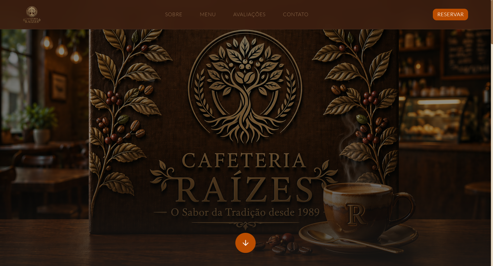
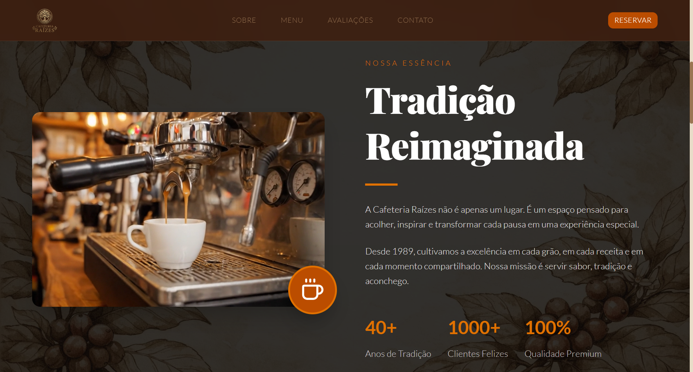
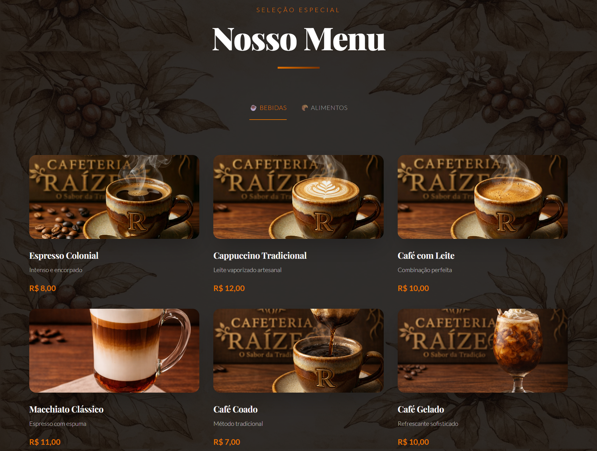
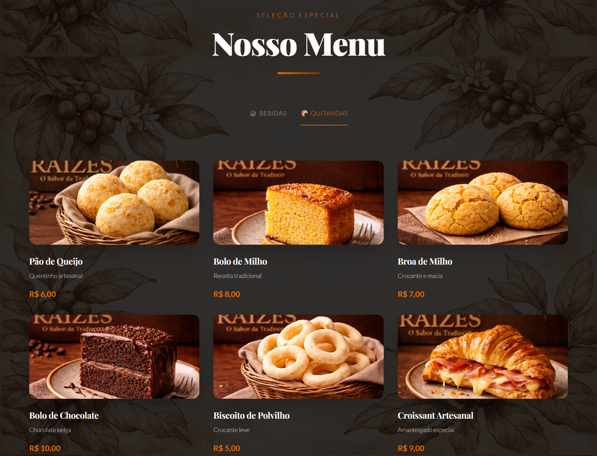
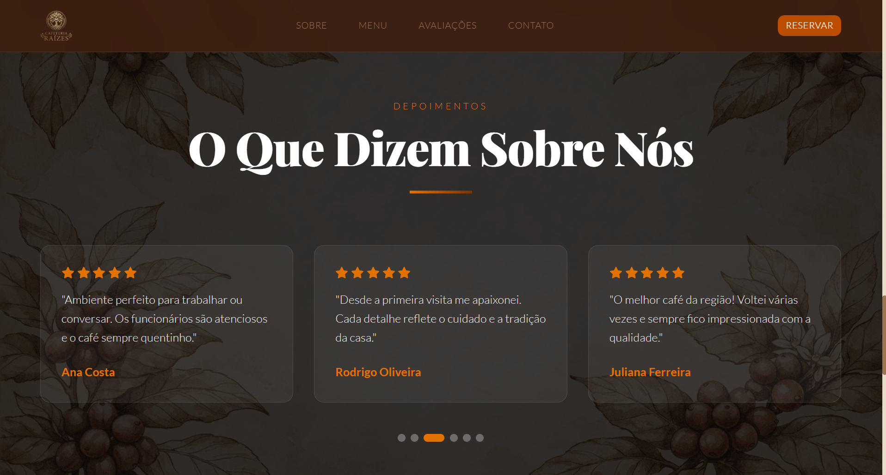
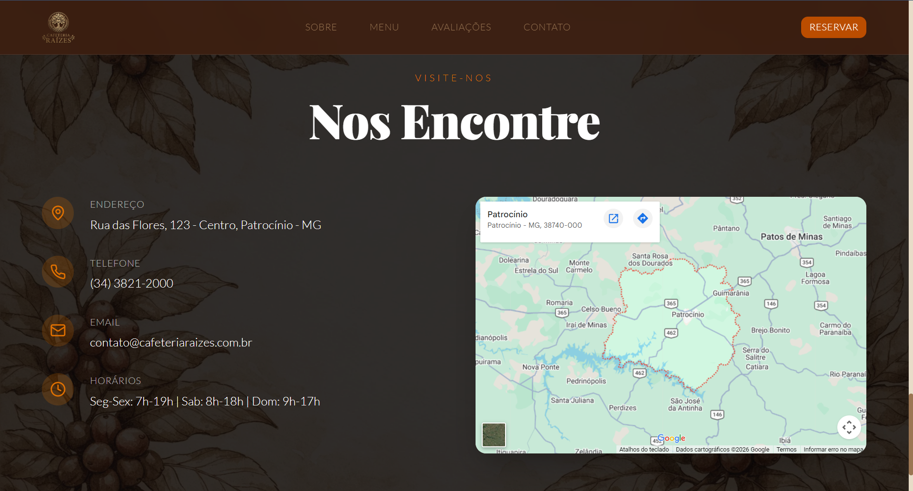

# ☕ Cafeteria Raízes - Sabor e Tradição

Aplicação web sofisticada para a Cafeteria Raízes, com design colonial mineiro, cardápio interativo, avaliações de clientes e integração de localização. Desenvolvida com React 19, Tailwind CSS 4 e foco em experiência premium do usuário.

## 🌐 Acesse o Projeto

👉 https://cafeteria-colonial-livid.vercel.app/

## 📌 Objetivo do Projeto

Este projeto foi desenvolvido com o objetivo de praticar e demonstrar habilidades em desenvolvimento front-end moderno, incluindo:

- construção de interfaces sofisticadas e responsivas com design colonial;
- desenvolvimento com React 19 e TypeScript;
- implementação de design system com paleta de cores temática;
- componentização e reutilização de elementos UI;
- integração de vídeos e mídia em background;
- foco em UX/UI aplicado a negócios reais;
- organização de código com boas práticas e arquitetura escalável.

## 🚀 Funcionalidades

- 🏛️ Design Colonial Sofisticado - Paleta de cores inspirada em café (#8b6f47, #6b4423, #4d2e19)
- 📹 Hero Section com Vídeo - Vídeo de preparo de café em background com overlay elegante
- ☕ Cardápio Interativo - Menu com abas (Bebidas e Quitandas) com cards sofisticados
- 📝 Sobre Nós em Cards - Seção com 3 cards elegantes descrevendo a essência da cafeteria
- ⭐ Avaliações de Clientes - 6 depoimentos com estrelas em layout responsivo
- 📍 Localização Integrada - Mapa interativo do Google Maps com informações de contato
- 🎨 Elementos Coloniais - Ornamentos decorativos, ícones temáticos e bordas sofisticadas
- 📱 Layout Totalmente Responsivo - Funciona perfeitamente em desktop, tablet e mobile
- 🎯 Navegação Fixa - Header com navegação fluida e botão de reserva destacado

## 🛠️ Tecnologias Utilizadas

- React 19
- TypeScript
- Tailwind CSS 4
- Vite
- Lucide React
- Wouter (roteamento leve)
- shadcn/ui
- Framer Motion
- Google Maps API

## 🏗️ Estrutura do Projeto

```
cafeteria-colonial/
│
├── client/
│   ├── public/                # Arquivos públicos (favicon, robots.txt)
│   ├── src/
│   │   ├── components/        # Componentes reutilizáveis
│   │   │   └── ui/            # Componentes de interface (Button, Card, etc.)
│   │   ├── contexts/          # Contextos globais (Tema)
│   │   ├── lib/               # Funções utilitárias
│   │   ├── pages/             # Páginas da aplicação
│   │   │   ├── Home.tsx       # Página principal com todas as seções
│   │   │   └── NotFound.tsx   # Página 404
│   │   ├── App.tsx            # Componente principal com roteamento
│   │   ├── main.tsx           # Entry point da aplicação
│   │   ├── index.css          # Estilos globais e design system
│   │   └── custom.css         # Estilos customizados adicionais
│   └── index.html             # Template HTML
│
├── server/                    # Placeholder para compatibilidade
├── shared/                    # Placeholder para compatibilidade
├── package.json               # Dependências e scripts
├── vite.config.ts             # Configuração do Vite
└── tsconfig.json              # Configuração TypeScript

```

## ⚙️ Organização da Aplicação

A aplicação foi estruturada seguindo boas práticas modernas:

- Componentização (React): reutilização de componentes e separação de responsabilidades;
- TypeScript: tipagem estática para maior segurança e escalabilidade;
- Estilização (Tailwind): construção de layouts modernos e consistentes;
- Design System: paleta de cores, tipografia e espaçamento consistentes;
- Context API: gerenciamento de estado global (tema);
- Separação por camadas: organização entre páginas, componentes, contextos e utilitários.

## ⭐ Diferenciais Técnicos

- Integração de vídeo em background com overlay elegante
- Design system completo com paleta de cores temática
- Componentes reutilizáveis e bem estruturados
- Tipografia estratégica para hierarquia visual
- Elementos decorativos coloniais (ornamentos, ícones)
- Sombras e bordas sofisticadas para profundidade
- Animações suaves em hover e transições
- Mapa interativo integrado
- Código limpo e bem documentado
- Arquitetura escalável para futuras expansões

## 📸 Interface do Sistema

### 📱 Infercace Completa

<p align="center">
  
</p>
 
### 🏠 Página Inicial - Hero Section

<p align="center">
  
</p>

### ☕ Seção Sobre

<p align="center">
  
</p>

### 🍵 Menu - Bebidas

<p align="center">
  
</p>

### 🍵 Menu - Quitandas

<p align="center">
  
</p>

### ⭐ Avaliações

<p align="center">
  
</p>

### 📍 Localização

<p align="center">
  
</p>

## ▶️ Como Executar o Projeto

### 1. Clonar o repositório

```shell
git clone https://github.com/felipe-frc/cafeteria-colonial.git
```

### 2. Acessar a pasta do projeto

```shell
cd cafeteria-colonial
```

### 3. Instalar dependências

```shell
pnpm install
```

### 4. Executar o projeto

```shell
pnpm dev
```

## ⚠️ Observações

- O mapa integrado depende da API do Google Maps 
- O vídeo de background está armazenado em CDN para otimização
- Todas as imagens e mídia estão otimizadas para web
- A aplicação é totalmente responsiva e funciona em todos os navegadores modernos

## 🧠 Decisões de Desenvolvimento

Durante o desenvolvimento deste projeto, foram adotadas algumas decisões técnicas importantes:

- Uso de React 19 + TypeScript: para garantir escalabilidade, organização e segurança no código;
- Vite como bundler: visando alta performance e tempo de build reduzido;
- Tailwind CSS 4: para criação rápida de layouts modernos com OKLCH color format;
- Paleta de cores temática: escolha de tons de café para reforçar a identidade da marca;
- Vídeo em background: para criar impacto visual e engajamento no hero;
- Componentes reutilizáveis: facilitando manutenção e escalabilidade;
- Design system completo: garantindo consistência visual em toda a aplicação;
- Tipografia estratégica: uso de diferentes fontes para criar hierarquia e elegância;
- Elementos coloniais: ornamentos e ícones para reforçar a essência do negócio;
- Separação de responsabilidades: organização clara entre UI, lógica e dados.

## 📈 Melhorias Futuras

- 📧 Formulário de contato interativo
- 🖼️ Galeria de fotos do ambiente e produtos
- 📅 Sistema de reservas com calendário
- 🔔 Newsletter e notificações por email
- 💳 Integração com sistema de pagamento
- 📊 Painel administrativo para gerenciar cardápio
- 🌙 Alternância entre tema claro/escuro
- 📱 Aplicativo mobile nativo
- 🔐 Sistema de autenticação de usuários
- 💾 Backend com banco de dados

## 📄 Licença

Este projeto está sob a licença MIT.

## 👨‍💻 Autor

**Felipe França**
